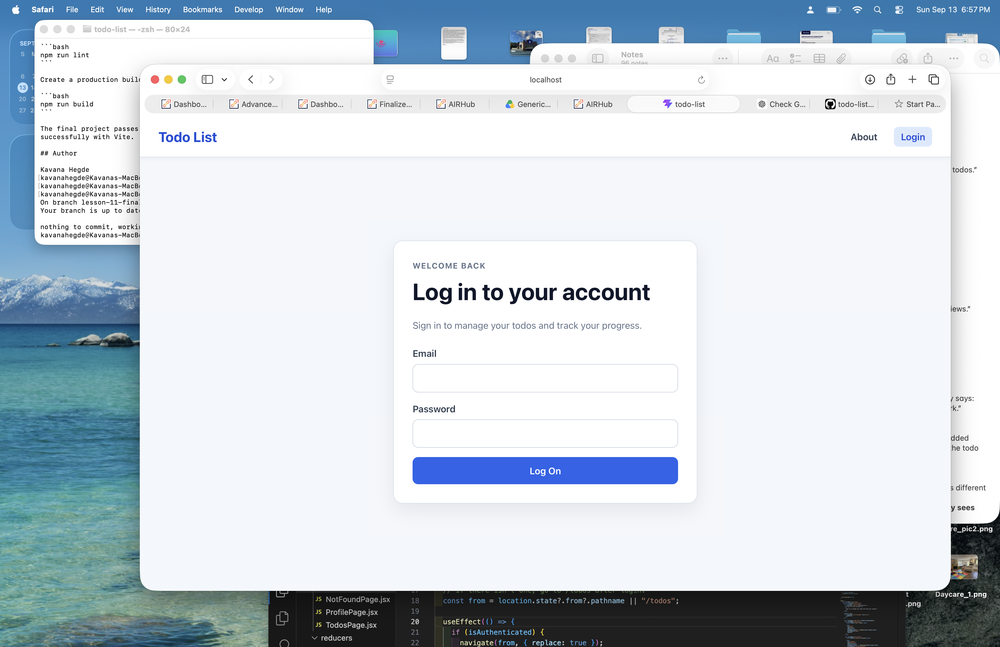
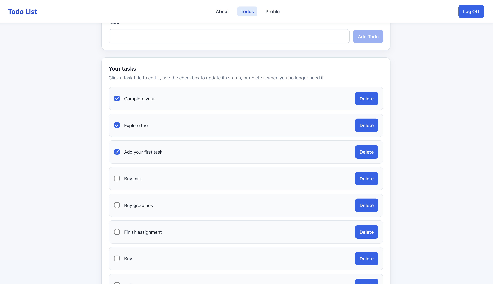
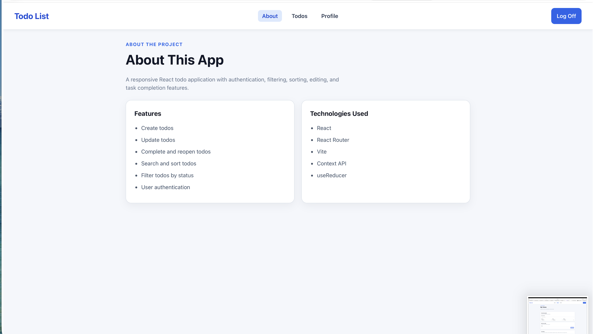
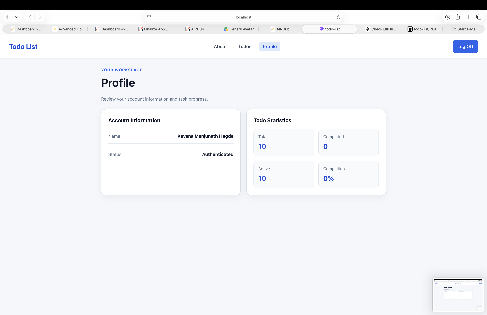
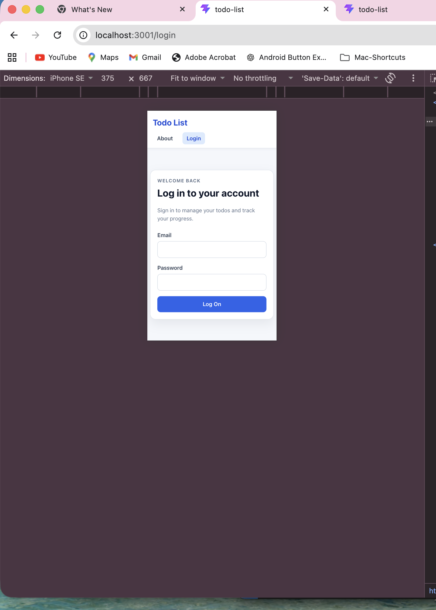

# My Todos

My Todos is a responsive Todo List application built with React and Vite. It allows authenticated users to create, edit, complete, reopen, delete, search, sort, and filter todos.

## Screenshots

The following screenshots show the styled application on both desktop and mobile screen sizes.

### Desktop Screenshots

#### Login Page



#### Todo Page



#### About Page



#### Profile Page



### Mobile Screenshot



## Features

* User authentication
* Create new todos
* Edit existing todos
* Complete and reopen todos
* Delete todos
* Search todos by title
* Sort todos by title or creation date
* Sort in ascending or descending order
* Filter todos by All, Active, or Completed status
* Todo input validation
* Profile page with todo statistics
* Protected routes
* Custom 404 page
* Responsive design
* Loading states
* Disabled states
* Error handling
* API error handling

## Technologies Used

* React
* React Router
* Vite
* JavaScript
* CSS
* Context API
* `useReducer`
* REST API

## Installation

Clone the repository and install the dependencies:

```bash
git clone https://github.com/kavanahegde/todo-list.git
cd todo-list
npm install
```

## Available Scripts

### `npm run dev`

Starts the Vite development server.

### `npm run build`

Creates a production build of the application.

### `npm run preview`

Previews the production build locally.

### `npm run lint`

Runs the linter and checks the project for code-quality issues.

## Run the Development Server

Start the application:

```bash
npm run dev
```

Vite will display the local URL in the terminal. Open that URL in your browser.

## Available Pages

* `/about` — About page
* `/login` — Login page
* `/todos` — Todo list page
* `/profile` — User profile and todo statistics
* Unknown routes — Custom 404 page

## Todo Functionality

Authenticated users can:

1. Add todos
2. Edit todos
3. Complete todos
4. Reopen completed todos
5. Delete todos
6. Search todos
7. Sort todos by title or creation date
8. Change sort direction
9. Filter todos by All, Active, or Completed

## Validation

Todo titles are validated before submission. Empty or invalid todo titles are blocked, and a maximum length limit is enforced.

## Authentication and Security

The application uses protected routes and authenticated API requests. Authentication state is managed through React Context.

The project also includes a `vercel.json` configuration for API rewrites required for production deployment.

## Loading, Empty, and Error States

The application provides:

* Loading indicators while data is being fetched
* Disabled controls during applicable operations
* User-friendly API error messages
* Empty-list feedback
* Filter-specific empty-state feedback

## Design Decisions

* **React Router** is used for navigation and protected routes.
* **Context API and `useReducer`** are used to manage authentication and todo state.
* The application is organized into reusable React components to make the code easier to maintain.
* Consistent spacing, typography, buttons, forms, and status indicators are used throughout the application.
* Responsive CSS allows the application to work across desktop and mobile screen sizes.

## Accessibility

The application includes:

* Keyboard-friendly controls
* Clear form labels
* Button-based actions
* Focus states
* Readable visual hierarchy
* Responsive layouts

## Live Demo

The application is not currently deployed.

The project includes a `vercel.json` configuration for production deployment and API rewrites.

## Production Deployment Configuration

The project includes a `vercel.json` file containing the configuration needed for production deployment and API rewrites.

## Quality Checks

The project was tested using:

```bash
npm run lint
npm run build
```

The project passes linting with **0 warnings and 0 errors**, and the production build completes successfully.

## Future Improvements

Possible future improvements include:

* Adding due dates and reminders
* Adding categories or tags
* Drag-and-drop todo organization
* Additional profile settings
* Further keyboard accessibility improvements
* More detailed filter-specific empty states

## License

This project is licensed under the MIT License.

See the [LICENSE](./LICENSE) file for the complete license text.

## Contact Information

**Kavana Hegde**

GitHub: https://github.com/kavanahegde/todo-list
